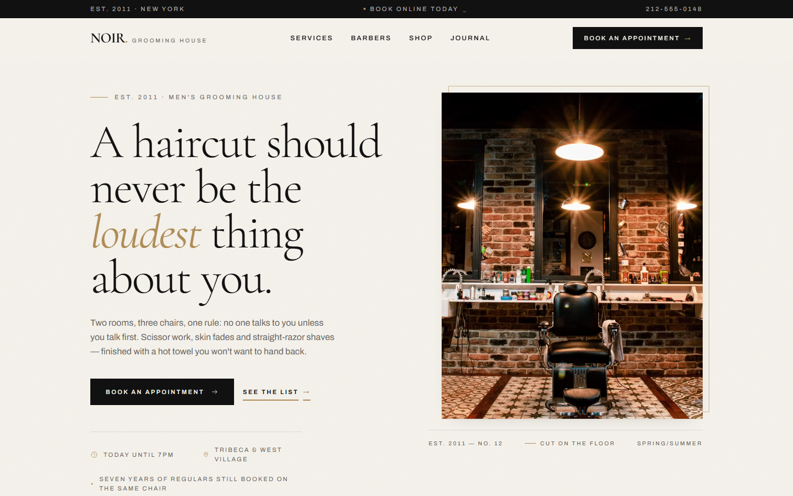
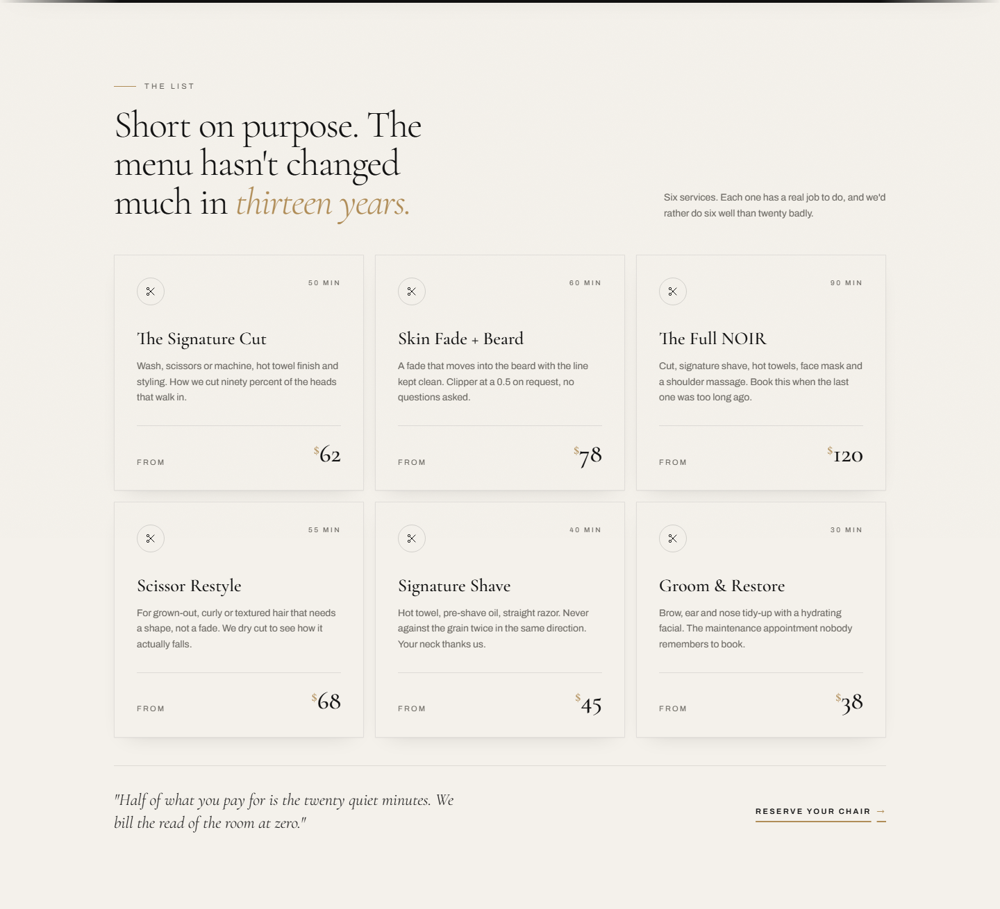
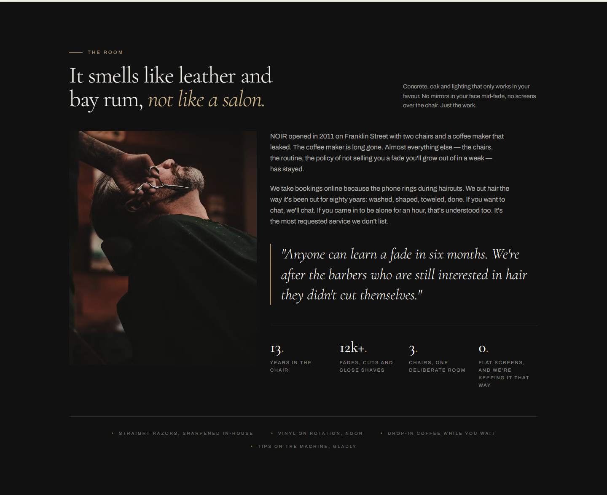
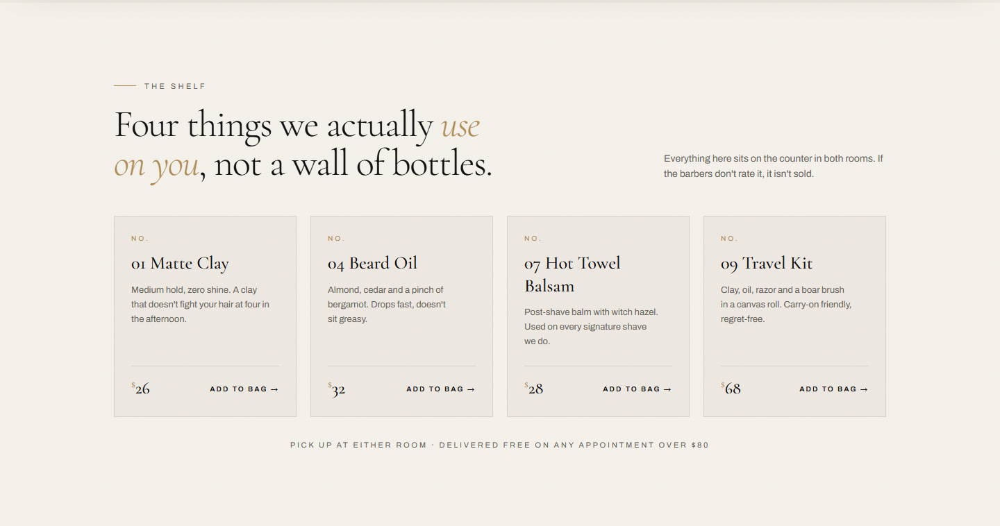
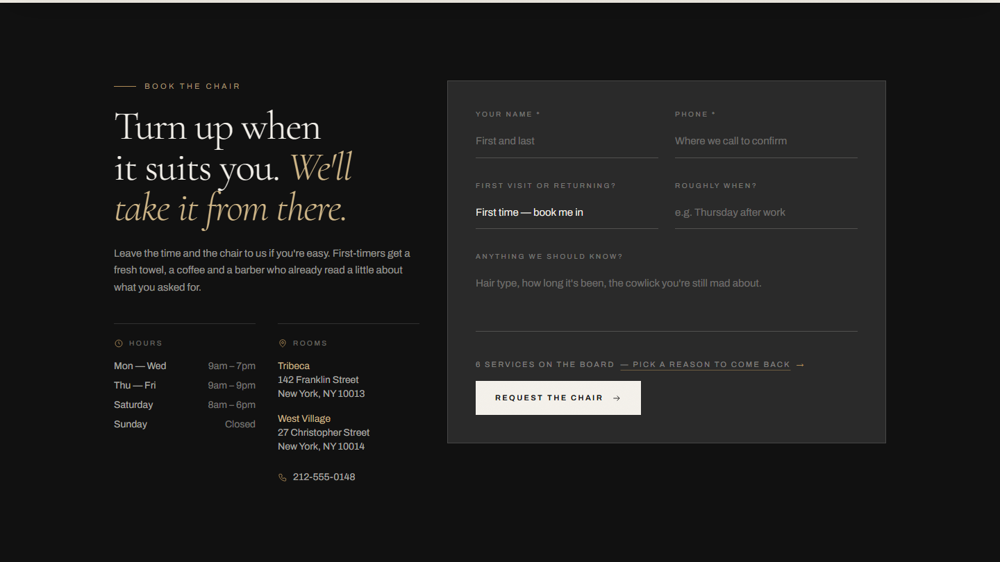

# NOIR

Landing page for a fictional men's grooming house in New York. Built as a portfolio piece.

React, Vite, Tailwind CSS v4. The colour palette comes from the NOIR brand system.

Live site: **https://HamidMbairik.github.io/NOIR/**

## Screenshots











## Run it

```sh
npm install
npm run dev
```

Build for production with `npm run build` (`dist/`), preview with `npm run preview`.

## Structure

- `src/data/content.js` — all the copy (services, barbers, hours, products, journal). Editing text is a one-file job.
- `src/components/` — one component per section.
- `src/index.css` — theme tokens plus the few keyframes used (reveal, marquee, cursor dot).
- `src/hooks/useParallax.js`, `src/components/CountUp.jsx`, `src/components/MotionFX.jsx`, `src/components/SmoothScroll.jsx` — the small bits that make it move.

## Palette

Defined once in `@theme` and referenced everywhere. No stray hex values.

| Role | Hex |
|---|---|
| Ink (primary) | `#111111` |
| Secondary | `#2A2A2A` |
| Paper (background) | `#F4F1EB` |
| Surface | `#E8E3DA` |
| Text | `#171717` |
| Muted | `#6B6862` |
| Gold (accent) | `#B08D57` |
| Gold light | `#D2B98A` |

## Known rough edges

- Images are hotlinked from Unsplash. `Photo.jsx` falls back to a brand-coloured block if one ever stops resolving — check the URLs before deploying anywhere serious.
- The booking form is front-end only. It swaps to a confirmation state; there's no backend behind it.
- Smooth scrolling is Lenis; it runs even for people with reduced-motion on, a deliberate trade-off for this project.
- `scroll-mt-32` on each section compensates for the fixed header. If the header height changes, those need a revisit.